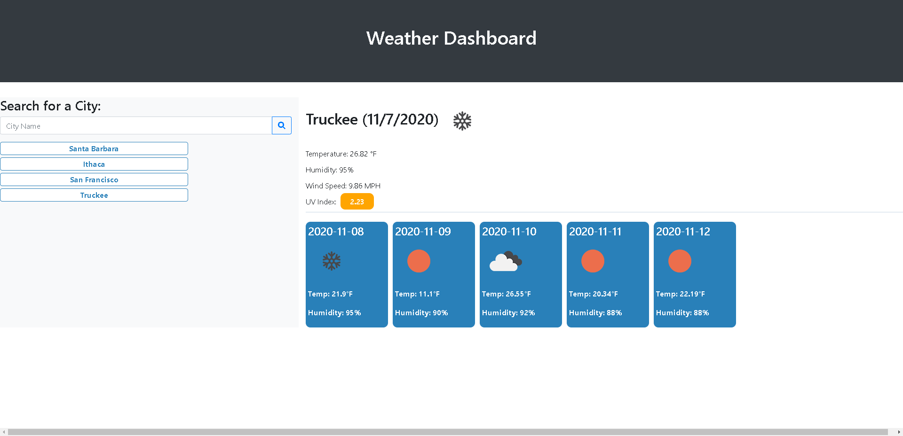

<h1>Weather_App</h1>
<h2>Dynamic weather app using data from Open Weather API</h2>

This project connects to Open Weather API to generate a dynamic weather app. The user can search
for a city and the app will return the current weather and 5-day forecast. The user's search is
saved for as long as they're on the page (it is cleared upon a page refresh), and the user can
click on a previously searched city to pull up that city's weather data again.

This project was my first introduction to APIs, and also served to really reinforce dynamically
generating HTML and dynamically styling through Javascript. 

Languages/tools utilized include HTML, CSS, Bootstrap, Javascipt, and JQuery.

Issues to return to: 
1) The forecast data from Open Weather API does not include today's date. I might need another API 
call to the weather API (vs forecast API). I was able to successfully build and incorporate this
functionality, but I removed it because of the below issue.
2) The click event associated with the search city buttons re-runs the function in which the data
is collected and pushed to the screen. When the function re-runs with the weather API (if incorporated
from above description), the page displays the city data twice on top of itself. 

Link to the deployed page:https://lizlarkin.github.io/Weather_App/weather.html

Screenshot: 

